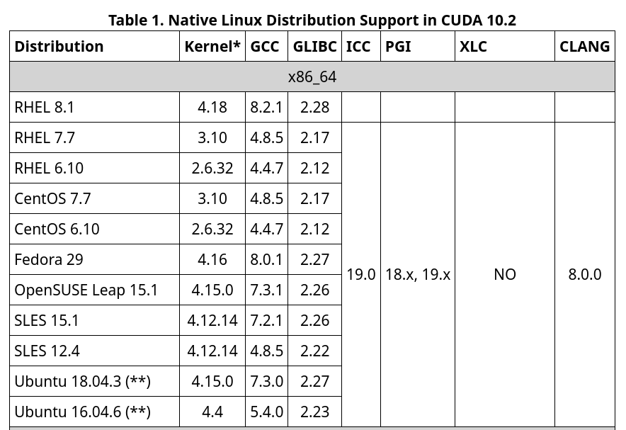

# How to install Nvidia Cuda

The process to install cuda is quite confusing and all over the place. This guide will help you set up cuda and cudnn on your system (assuming you have an Nvidia GPU) in order to run tensorflow-gpu and actually use the GPU.

## Pre-reqs

As of now, the latest tf is 2.2.0. Tensorflow version 2+ does not work with Cuda 10.2 so you have to install Cuda 10.1 instead. This guide is what has worked for me using Ubuntu 20.04 but it should also work with 18.04 since I followed guides for the that version. 



The default GCC and G++ version for Ubuntu 20.04 should be 9.3 or something similar. CuDNN will not make with this version, you can install multiple versions of GCC and using the `update-alternatives` apt get utility. 

```
sudo apt install build-essential
sudo apt -y install gcc-7 g++-7 gcc-8 g++-8 gcc-9 g++-9
```

After installing several versions of GCC and G++, you can index them using `update-alternatives` tool like so:

```
sudo update-alternatives --install /usr/bin/gcc gcc /usr/bin/gcc-7 7
sudo update-alternatives --install /usr/bin/g++ g++ /usr/bin/g++-7 7
sudo update-alternatives --install /usr/bin/gcc gcc /usr/bin/gcc-8 8
sudo update-alternatives --install /usr/bin/g++ g++ /usr/bin/g++-8 8
sudo update-alternatives --install /usr/bin/gcc gcc /usr/bin/gcc-9 9
sudo update-alternatives --install /usr/bin/g++ g++ /usr/bin/g++-9 9
```

You can then switch between the versions using 
```
sudo update-alternatives --config gcc
```

which should output something like :

```
There are 3 choices for the alternative gcc (providing /usr/bin/gcc).

  Selection    Path            Priority   Status
------------------------------------------------------------
  0            /usr/bin/gcc-9   9         auto mode
* 1            /usr/bin/gcc-7   7         manual mode
  2            /usr/bin/gcc-8   8         manual mode
  3            /usr/bin/gcc-9   9         manual mode

Press <enter> to keep the current choice[*], or type selection number:
```

Select 1 since 10.1 requires GCC of less than 8.

## Cuda 10.1 installation

You can follow the official instructions [here](https://docs.nvidia.com/cuda/cuda-installation-guide-linux/). Below are the steps that I followed to get it running on my PC.

Download the archived 10.1 .deb package [here](https://developer.nvidia.com/cuda-10.1-download-archive-base). Select x86_64 and ubuntu version 18.04. 


To install the deb package:
```
sudo dpkg -i cuda-repo-ubuntu1804-10-1-local-10.1.105-418.39_1.0-1_amd64.deb

sudo apt-key add /var/cuda-repo-10-1-local-10.1.105-418.39/7fa2af80.pub

sudo apt-get update

sudo apt-get install cuda
```

With Cuda installed, you still won't be able to run Tensorflow on the GPU since it also needs CuDNN7.

## CuDNN 7 installation

[Official instructions here](https://docs.nvidia.com/deeplearning/sdk/cudnn-install/index.html#installlinux)

You need an Nvidia Developer account in order to download the runtime and developer libraries.

[Download here](https://developer.nvidia.com/rdp/cudnn-download)

Select all three and download:

```
cuDNN Runtime Library for Ubuntu18.04 (Deb)

cuDNN Developer Library for Ubuntu18.04 (Deb)

cuDNN Code Samples and User Guide for Ubuntu18.04 (Deb)
```

With the three .deb packages downloaded, run each of them with dpkg to isntall them:

The runtime library: 
`sudo dpkg -i libcudnn7_7.6.5.32-1+cuda10.2_amd64.deb`

The developer library:
`sudo dpkg -i libcudnn7-dev_7.6.5.32-1+cuda10.2_amd64.deb`

And optional the code samples. I would suggest do this one as well since you can run one of the samples to verify Cudnn was installed properly:
`sudo dpkg -i libcudnn7-doc_7.6.5.32-1+cuda10.2_amd64.deb`

Thats it!

## Verify installation

Straight from the official docs:

1. Copy the cuDNN sample to a writable path.

    `cp -r /usr/src/cudnn_samples_v7/ $HOME`

2. Go to the writable path.

    `cd  $HOME/cudnn_samples_v7/mnistCUDNN`

3. Compile the mnistCUDNN sample.

    `make clean && make`

4. Run the mnistCUDNN sample.

    `./mnistCUDNN`

If cuDNN is properly installed and running on your Linux system, you will see a message similar to the following:

`Test passed!`

If the correct version of GCC is not installed (version 7) the make command will throw a gcc error. See above to install the correct GCC and rerun.

You can then run the following python in order to verify that tensorflow-gpu is correctly recognizing the GPU:

```
import tensorflow as tf
from tensorflow import keras

import numpy as np
import matplotlib.pyplot as plt

print(tf.__version__)

print("Num GPUs Available: ", len(tf.config.experimental.list_physical_devices('GPU')))
```

It should output atleast one GPU. My output below:

```2.2.0
2020-05-14 21:59:04.077939: I tensorflow/stream_executor/platform/default/dso_loader.cc:44] Successfully opened dynamic library libcuda.so.1
2020-05-14 21:59:04.117048: I tensorflow/stream_executor/cuda/cuda_gpu_executor.cc:981] successful NUMA node read from SysFS had negative value (-1), but there must be at least one NUMA node, so returning NUMA node zero
2020-05-14 21:59:04.117403: I tensorflow/core/common_runtime/gpu/gpu_device.cc:1561] Found device 0 with properties: 
pciBusID: 0000:0a:00.0 name: GeForce RTX 2070 SUPER computeCapability: 7.5
coreClock: 1.785GHz coreCount: 40 deviceMemorySize: 7.79GiB deviceMemoryBandwidth: 417.29GiB/s
2020-05-14 21:59:04.118400: I tensorflow/stream_executor/platform/default/dso_loader.cc:44] Successfully opened dynamic library libcudart.so.10.1
2020-05-14 21:59:04.139527: I tensorflow/stream_executor/platform/default/dso_loader.cc:44] Successfully opened dynamic library libcublas.so.10
2020-05-14 21:59:04.149136: I tensorflow/stream_executor/platform/default/dso_loader.cc:44] Successfully opened dynamic library libcufft.so.10
2020-05-14 21:59:04.151950: I tensorflow/stream_executor/platform/default/dso_loader.cc:44] Successfully opened dynamic library libcurand.so.10
2020-05-14 21:59:04.174307: I tensorflow/stream_executor/platform/default/dso_loader.cc:44] Successfully opened dynamic library libcusolver.so.10
2020-05-14 21:59:04.188912: I tensorflow/stream_executor/platform/default/dso_loader.cc:44] Successfully opened dynamic library libcusparse.so.10
2020-05-14 21:59:04.227864: I tensorflow/stream_executor/platform/default/dso_loader.cc:44] Successfully opened dynamic library libcudnn.so.7
2020-05-14 21:59:04.227984: I tensorflow/stream_executor/cuda/cuda_gpu_executor.cc:981] successful NUMA node read from SysFS had negative value (-1), but there must be at least one NUMA node, so returning NUMA node zero
2020-05-14 21:59:04.228512: I tensorflow/stream_executor/cuda/cuda_gpu_executor.cc:981] successful NUMA node read from SysFS had negative value (-1), but there must be at least one NUMA node, so returning NUMA node zero
2020-05-14 21:59:04.228943: I tensorflow/core/common_runtime/gpu/gpu_device.cc:1703] Adding visible gpu devices: 0
Num GPUs Available:  1
```