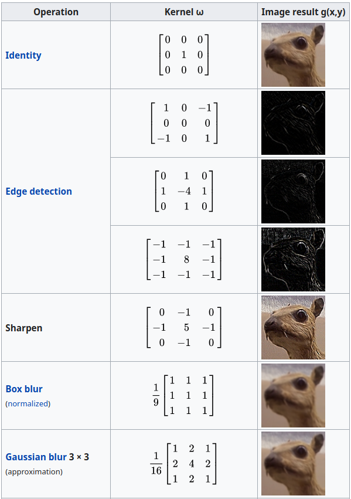

# Part 1

This series is to track my progress in learning new topics of AI as I come across them.

## RNNs and CNNs
I came across [Jeremy Cohen's](https://medium.com/@jeremyscohen/rnns-in-computer-vision-b04b438d805c) post on RNNs in Computer Vision while I was looking into how to solve CommaAi's speed challenge problem. I learned that RNNs and CNNs solve fundamentally different problems, but can work together in order to come up with more useful, dynamic solutions.

I've read about Convolutional Neural networks many times before in college and for fun. The basic idea is it uses kernels (small matrices) and convolves an image by reducing it to areas that match the kernel shape in order to highlight areas of the image that match a certain feature. This can be done with many different kernels in order to extract many features like lines, curves, etc. 

### Convolution

The basis of the CNN is the convolution step. Each kernel is an NxN matric that tests a specific feature like a diagonal line or curve. The result of convolving an image with one kernel is a smaller representation of the same image, but with only the feature selected as being emphasized. 

Figure from [Wikipedia](https://en.wikipedia.org/wiki/Kernel_(image_processing))

1. The kernel moves over each NxN section of the image. Each value of the kernel is multiplied with the corresponding image value. These values are averaged across the kernel size (N^2) and then put in that position on the output image. 

