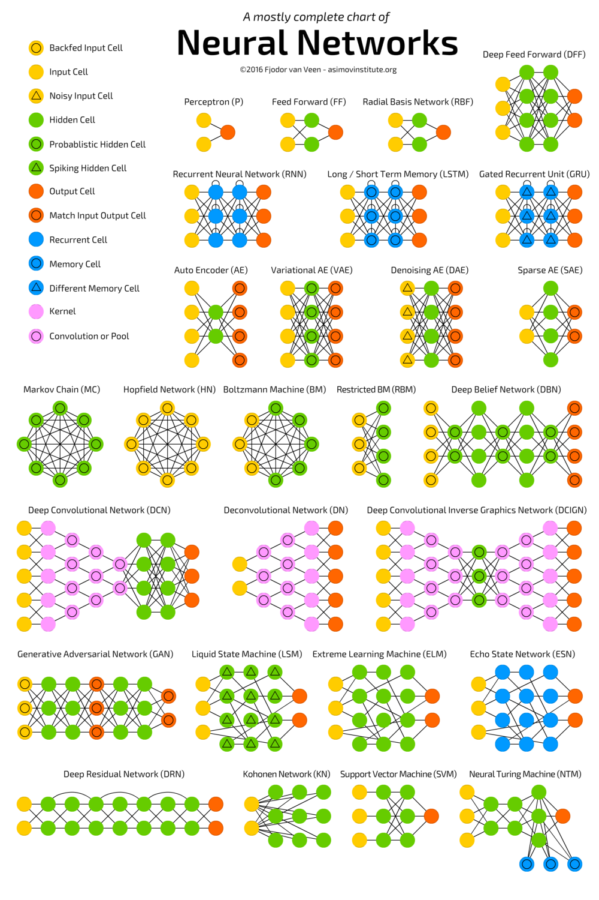

# Speed Challenge

The [challenge](https://github.com/commaai/speedchallenge) involves creating an AI algorithm that accurately predicts the speed of a moving car from dashcam footage. Seems like a decent challenge.

My first thought is to play with the data somehow. I use opencv to open the video file per frame and display it in a cv window. Not sure what to else to do so I run Canny Edge Detection on each frame and render the edges instead. Get something kind of interseting, but not sure if it's relevant.

Next step is to figure out which ML algorithm to use to determine speed. There are so many different network types for different applications.

The goal is to figure out which one of these networks will work for this application. Most of the NN I've been practically exposed to are classification networks. They take an image input and output with a one-hot or a percentage of a prediction for a unique classification. I suppose since the data has a single float for the speed of the car at each frame, we could train a CNN to output a flaot per frame. I suppose the accuracy of the CNN would depend on the kernel chosen. What features are we trying to extract from each image?

Well it's not each image in isolation though. Speed is calculated as distance over time so each frame needs to contribute to the next frame's prediction. I think I'll just run a basic FF neural net on the data and see what happens.

Step 1: Save each frame's pixel data in a numpy array. Training images should be an array of the shape: 